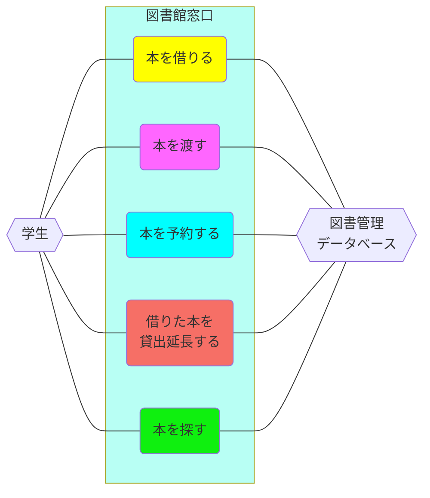

```mermaid

flowchart LR

s{{学生}}
s---t1(本を借りる)
s---t2(本を渡す)
s---t3(本を予約する)
s---t4(借りた本を\n貸出延長する)
s---t5(本を探す)

subgraph m[図書館窓口]
t1
t2
t3
t4
t5
end

style m fill:#B8FFF4
style t1 fill:#FFFF00
style t2 fill:#FF66FF
style t3 fill:#00FFFF
style t4 fill:#F66F66
style t5 fill:#0FF00F

u{{図書管理 \nデータベース}}
t1---u
t2---u
t3---u
t4---u
t5---u
```

 
